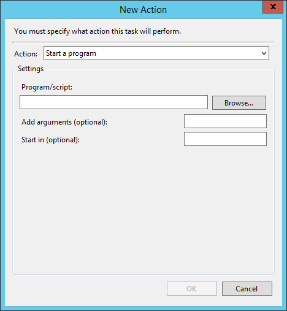

# Schedule Powershell Scripts

The windows scheduler enables the execution of programs at pre-defined intervals and these can be executables, BAT files or powershell scripts. 
Special attention is required when the powershell script expects command line arguments and the steps below describe the values for each field in WIndows schedule action screen.




| Field      | Value | Notes   |
| :---       |:----   |:-----|
| Program/Script|C:\Windows\System32\WindowsPowerShell\v1.0\powershell.exe||
| Add arguments(optional) |-noprofile -ExecutionPolicy ByPass -command "& {.\myscriptname.ps1 -Server server1 -Target \\server2\Share1 -StartDateTime ((get-date).AddMinutes(-120)) -EndDateTime (get-date)}"|Here two of the arguments are computed on the fly|
|Start in (optional)|C:\Scripts||


When the task is exported the XML fragment for Actions looks like this.

```xml
<Actions Context="Author">
    <Exec>
        <Command>C:\Windows\System32\WindowsPowerShell\v1.0\powershell.exe</Command>
        <Arguments>-noprofile -ExecutionPolicy ByPass -command "&amp; {.\myscriptname.ps1 -Server server1 -Target \\server2\Share1 -StartDateTime ((get-date).AddMinutes(-15)) -EndDateTime (get-date)}"</Arguments>
        <WorkingDirectory>C:\Scripts</WorkingDirectory>
    </Exec>
</Actions>
```
